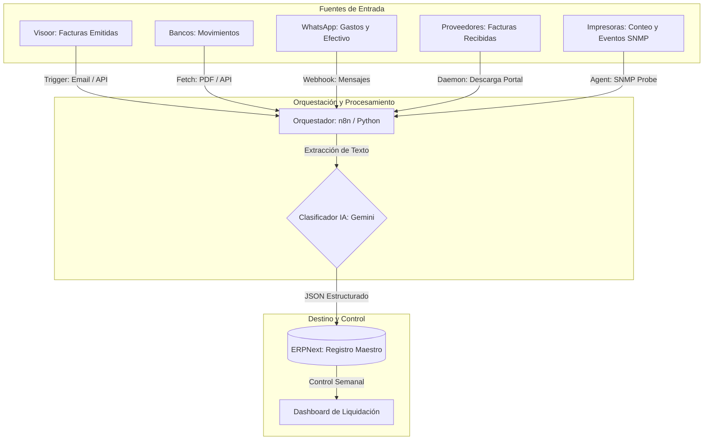

# Arquitectura de Automatización Financiera

Este documento describe la infraestructura tecnológica y los flujos lógicos diseñados para automatizar el registro, clasificación y conciliación de la información financiera del negocio.

---

## 1. Visión Técnica
El sistema actúa como un **Middleware Inteligente** que captura datos de fuentes heterogéneas (Email, Portales Web, WhatsApp, Bancos), los estructura mediante Inteligencia Artificial y los deposita en el Registro Maestro (**ERPNext**).

## 2. Diagrama de Flujo de Datos

---

## 3. Componentes de la Solución

### 3.1 Capturador de Facturas (Visoor y Proveedores)
- **Mecánica**: Un daemon que monitorea la cuenta de correo y/o se loguea en el portal del proveedor para descargar el XML de las facturas.
- **Lógica**: Extrae el emisor, receptor, conceptos y montos para crear automáticamente la "Factura de Compra" o "Factura de Venta" en ERPNext.

### 3.2 Asistente de IA (WhatsApp)
- **Mecánica**: Integración con WhatsApp via API.
- **Lógica de IA**: El modelo (Gemini) recibe el mensaje y lo clasifica:
    - **GASTO**: Genera un asiento de salida de efectivo.
    - **COBRO**: Identifica al cliente y aplica el pago a su CxC pendiente.
    - **ACLARACIÓN**: Archiva el mensaje como nota en el registro maestro.

### 3.3 Motor de Conciliación Bancaria
- **Mecánica**: Cruce automatizado entre los depósitos detectados en el banco y las facturas emitidas pendientes de pago.
- **Regla de Oro**: Si el monto y la fecha coinciden (con un margen de error configurable), el sistema sugiere el pago automático de la factura.

### 3.4 Agente de Monitoreo de Campo (SNMP)
- **Mecánica**: Un "Probe" (Raspberry/Orange Pi o script) en la red del cliente que interroga a los equipos.
- **Lógica**: Extrae contadores para facturación automática y niveles de tóner/errores para mantenimiento proactivo.

---

## 4. Herramientas Seleccionadas

| Herramienta | Función | Justificación |
| :--- | :--- | :--- |
| **ERPNext** | Core Contable/Operativo | Código abierto, modular y escalable. |
| **n8n.io** | Orquestador de Flujos | Low-code, permite integraciones rápidas sin dependencias externas. |
| **Google Gemini API** | Inteligencia Artificial | Alta capacidad de razonamiento y extracción de datos estructurados. |
| **Python** | Scripts de "Browsing" | Para navegar portales de proveedores que no tienen API. |

---

## 5. Implementación Progresiva
1. **Módulo IMAP/SMTP**: Conexión con facturador.
2. **Bot de WhatsApp**: Lógica de clasificación de mensajes simples.
3. **Módulo Bancario**: Procesamiento de archivos PDF/Excel de estados de cuenta.
4. **Dashboard de Conciliación**: Vista final para que los socios validen el trabajo de la automatización.
