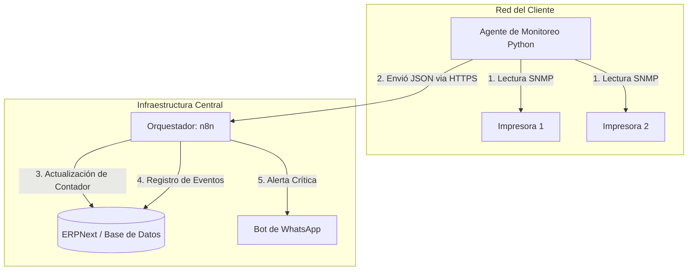

# Propuesta: Automatización del Monitoreo y Conteo de Impresoras

Esta propuesta detalla cómo integrar el monitoreo remoto de dispositivos en la arquitectura de profesionalización del negocio, permitiendo un control preciso de facturación y mantenimiento preventivo.

## Resumen de la Solución
Implementar un **Agente de Monitoreo Ligero (Probe)** basado en Python que utilice el protocolo **SNMP** (Simple Network Management Protocol) para recolectar datos en tiempo real de las impresoras y enviarlos al orquestador central (n8n) para su procesamiento en ERPNext.

---

## Arquitectura de Monitoreo

### 1. El Agente (Probe): Concepto e Implementación

El **Agente (Probe)** es un software ligero cuya única función es actuar como un "puente" entre la red local del cliente (donde están las impresoras) y tu infraestructura en la nube (n8n/ERPNext).

### ¿En qué consiste?
Es un script desarrollado generalmente en **Python** (debido a su excelente manejo de redes y bajo consumo de recursos). 
1. **Descubrimiento**: Escanea la red local buscando dispositivos con puertos SNMP abiertos (puerto 161).
2. **Interrogación**: Consulta las OIDs (Object Identifiers) específicas de cada impresora.
3. **Reporte**: Empaqueta los datos en un JSON y los envía via HTTPS (POST) a un Webhook de n8n.

### ¿Cómo se implementaría?
*   **Contenerización**: Se empaqueta en un contenedor **Docker** para asegurar que funcione igual en cualquier equipo (PC o Raspberry).
*   **Seguridad**: El agente solo envía datos *outbound* (hacia afuera), por lo que no requiere abrir puertos en el firewall del cliente. Se usa una `API_KEY` para que n8n solo acepte datos de tus agentes autorizados.

---

## 2. Comparativa Tecnológica: SNMP vs. Web Scraping (Puppeteer)

| Característica | Lectura SNMP (Estandarizado) | Web Scraping (Puppeteer/Node) |
| :--- | :--- | :--- |
| **Consumo de Recursos** | **Extremadamente Bajo**: Consultas de pocos bytes. | **Alto**: Requiere levantar un navegador (Chromium) en memoria. |
| **Velocidad** | Instantánea (milisegundos). | Lenta (segundos por equipo para renderizar la web). |
| **Estabilidad** | Alta: Las OIDs rara vez cambian entre modelos de la misma marca. | Baja: Si el fabricante actualiza el firmware y cambia el diseño web, el scraping falla. |
| **Compatibilidad** | Universal en equipos profesionales. | Requiere desarrollar un script específico para cada interfaz web distinta. |
| **Fiabilidad** | Diseñado para monitoreo. | Propenso a bloqueos por la interfaz de la impresora. |

> [!TIP]
> **Veredicto**: SNMP es la opción profesional para gestión de flotas. El Web Scraping solo se recomienda como último recurso si una impresora extremadamente básica no soporta SNMP.

---

## 3. Variables a Monitorear (Detalle Granular)

Para una gestión automatizada de rentas y servicios, propongo estas 3 categorías:

### A. Gestión de Facturación (Contadores)
*   **Total Page Count**: Conteo acumulado histórico (Vida del equipo).
*   **Color vs Mono**: Desglose si cobras diferente por impresiones a color.
*   **Scan/Copy Count**: Si el contrato incluye límites en el uso del escáner.

### B. Mantenimiento Preventivo (Insumos)
*   **Toner Levels (C, M, Y, K)**: Porcentaje restante. Permite enviar el repuesto antes de que el cliente se quede sin imprimir.
*   **Drum/Maintenance Kit Life**: Porcentaje de vida de las piezas de desgaste para programar visitas técnicas preventivas.

### C. Alertas Técnicas (Eventos)
*   **Device Status**: (Atasco de papel, Puerta abierta, Sin papel, Error de fusor).
*   **Log de Errores**: Captura de códigos de error específicos (ej. Error 59.F0 en HP) para que el técnico sepa qué pieza llevar antes de salir.

---

## 4. Análisis de Infraestructura en Sitio del Cliente

### Opción 1: Raspberry Pi (Hardware Dedicado)
*   **Pros**: 
    *   Control total sobre el entorno.
    *   No depende de que el cliente apague su PC.
    *   Bajo consumo eléctrico.
*   **Contras**: 
    *   Costo de hardware adicional por cliente.
    *   Logística de entrega e instalación física.

### Opción 2: Script/Docker en PC del Cliente
*   **Pros**:
    *   Costo cero en hardware.
    *   Instalación remota (vía TeamViewer/AnyDesk).
*   **Contras**:
    *   Si el usuario apaga la PC, perdemos el monitoreo.
    *   Riesgo de que el usuario desinstale el software por error o sospecha.

## 5. Recomendaciones de Hardware (Raspberry Pi)

Para la tarea de "SNMP Probe", no necesitas una gran potencia de cómputo. Lo más importante es la **estabilidad de la conexión** y la **disponibilidad**.

### Modelos y Alternativas Recomendadas

Además de la Raspberry Pi, existen otras opciones interesantes dependiendo del presupuesto y la disponibilidad:

| Hardware | Tipo | Viabilidad | Observaciones |
| :--- | :--- | :--- | :--- |
| **Raspberry Pi 3B+** | SBC (Linux) | **Alta (Recomendada)** | Estabilidad total, comunidad gigante, Ethernet nativa. |
| **Orange Pi Zero 3** | SBC (Linux) | **Alta (Económica)** | Excelente alternativa "low-cost". Más potente y barata que la RPi equivalente. Usa el mismo software (Docker/Python). |
| **ESP32 (WROOM/ETH)**| Microcontrolador | **Media/Baja** | Muy barato (<$10), pero requiere programar en C++/Arduino. Manejar HTTPS y JSON complejo es más tedioso. No soporta Docker. |
| **Mini PC (Refurbished)**| x86 (Win/Linux) | **Alta (Potencia)** | Una Dell Optiplex pequeña u similar. Son indestructibles y muy rápidas para redes grandes. |

#### Análisis del ESP32 para esta tarea:
Aunque el **ESP32** es extremadamente económico, tiene limitaciones importantes para un contexto empresarial de rentas:
1.  **Programación**: No puedes usar los mismos scripts de Python fácilmente (MicroPython es una opción, pero menos robusta para red).
2.  **Mantenimiento**: Actualizar el código de 50 ESP32s en diferentes clientes es mucho más difícil que actualizar un contenedor Docker en una Raspberry/Orange Pi.
3.  **Red**: La mayoría son solo Wi-Fi. En una oficina, el Wi-Fi de las impresoras suele ser inestable; Ethernet es ley.

---

## 6. Estrategia para Múltiples Redes / Segmentos

Si un cliente tiene impresoras en diferentes subredes (VLANs o redes físicas distintas), tienes dos caminos:

### A. Una Raspberry por Segmento (La más sencilla)
Si las redes están físicamente aisladas o el cliente no permite enrutamiento entre ellas por seguridad.
*   **Implementación**: Instalas un Agente en cada red. Cada agente enviará sus datos con un `site_id` diferente a tu n8n.

### B. Una Raspberry Multisubsidaria (La más eficiente)
Si las redes están conectadas por un router/firewall que permite el tráfico entre ellas.
*   **Implementación**: Solo necesitas **una** Raspberry en la red principal. Debes pedir al equipo de IT del cliente que:
    1.  Permita el tráfico del puerto **UDP 161 (SNMP)** desde la IP de la Raspberry hacia las otras subredes.
    2.  Configurar rutas estáticas si es necesario.
*   **Redes Virtuales (ZeroTier / Tailscale)**: Si las redes están en ubicaciones geográficas distintas, puedes instalar ZeroTier en la Raspberry y en una PC de cada sucursal para crear una "red privada virtual" y ver todas las impresoras como si estuvieran en el mismo lugar.

---

## 7. Resumen de Implicaciones Técnicas

| Factor | Raspberry Pi | Script en PC |
| :--- | :--- | :--- |
| **Costo inicial** | ~$50 - $80 USD | $0 |
| **Dependencia** | Independiente del usuario. | Depende de que la PC esté encendida. |
| **Instalación** | Requiere visita física (o envío configurado). | 100% Remota. |
| **Escalabilidad** | Ideal para nodos críticos. | Ideal para pilotos o clientes pequeños. |

## 8. Redundancia y Alta Disponibilidad (HA)

Instalar el script en varios equipos es una excelente idea para evitar "puntos únicos de falla", pero requiere una estrategia clara para evitar desorden.

### A. ¿Existe riesgo de interferencia?
**No a nivel técnico de red**, pero sí a nivel de datos:
*   **Protocolo**: SNMP es muy ligero; que dos equipos consulten a una impresora al mismo tiempo no le causa "estrés" ni bloqueos (las impresoras modernas manejan múltiples consultas concurrentes).
*   **El problema real**: Recibirás el mismo dato dos veces en tu orquestador (n8n), lo que podría causar registros duplicados en ERPNext o disparar dos veces la misma alerta de tóner.

### B. Estrategia de Redundancia Recomendada

#### 1. Deduplicación en el Orquestador (La más robusta)
En lugar de que los agentes decidan quién habla, dejas que todos envíen datos y manejas la "inteligencia" en **n8n**:
*   **Mecánica**: n8n recibe el reporte. Antes de escribir en ERPNext, revisa una base de datos rápida (como Redis o una tabla simple) para ver si ya recibió un reporte de *esa impresora* en los últimos 5 minutos.
*   **Ventaja**: Si una PC se apaga, la otra sigue enviando datos y n8n simplemente procesa el primero que llegue.

#### 2. Modelo Activo-Pasivo (Basado en ID)
Asignas una prioridad a cada equipo (PC1 = Principal, PC2 = Respaldo).
*   **Mecánica**: El script en la PC2 solo envía datos si detecta que la PC1 lleva 10 minutos sin reportar nada.
*   **Ventaja**: Menos tráfico de red y menos carga para n8n.

### C. Matriz de Decisión de Redundancia

| Escenario | Estrategia |
| :--- | :--- |
| **PC de Oficina (Uso diario)** | **Deduplicación Centralizada**: Instala en 2 PCs. n8n descarta el duplicado. Es lo más seguro si los usuarios apagan sus equipos aleatoriamente. |
| **Servidor / Raspberry Pi** | **Sin Redundancia**: Si el equipo es dedicado y tiene respaldo de energía (UPS), no suele ser necesaria la redundancia física. |
| **Crítico (Flota +20 equipos)** | **Failover Cluster**: Uso de herramientas como `Keepalived` (en Linux) para que una IP "flote" entre dos Raspberrys. |

---

## 9. Seguridad y Mejores Prácticas

1.  **SNMP v3**: Si las impresoras lo soportan, usa la versión 3 del protocolo, ya que cifra la comunicación y requiere usuario/contraseña. (v1/v2 usan "comunidades" de texto plano).
2.  **Solo Lectura (Read-Only)**: Asegúrate de que la comunidad SNMP esté configurada como "Solo Lectura" para que nadie pueda cambiar configuraciones de la impresora a través de la red.
3.  **Whitelist**: Configura la impresora para que solo acepte peticiones SNMP desde las IPs específicas de tus agentes (Raspberry o PCs autorizadas).

> [!IMPORTANT]
> La redundancia es buena, pero la **simplicidad** es mejor. Para tu volumen de 50-60 equipos, la estrategia de **Deduplicación en n8n** es la más equilibrada: fácil de implementar y muy confiable.
